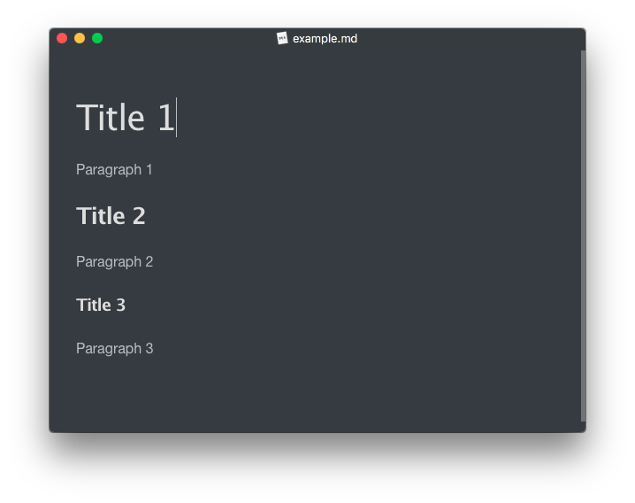
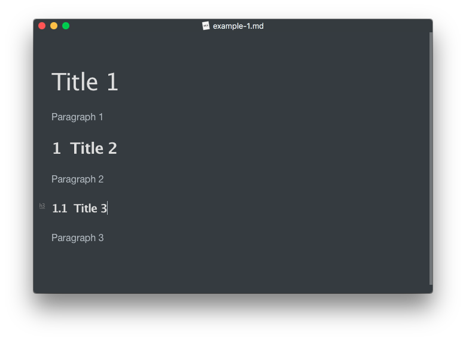

# MarkIndex

为你的Markdown标题添加索引的小工具

## 使用说明

这是原始的Markdown文件:



然后对它执行:

```bash
python markindex.py example.md
```

随后脚本生成了一个新的Markdown文件（为了不覆盖原文件）：`example-1.md`，它的内容是：



脚本自动为您的Markdown文件的标题添加了数字索引，按照`1.1, 1.1.1`这样的格式。

注意此处一级标题被忽略了，因为他们通常是总标题，无须添加索引。

您可以使用`-h, --help`选项来查看更多操作：

```bash
usage: markindex.py [-h] [-r] [-f] markdown [markdown ...]

Add Index to markdown titles.

positional arguments:
  markdown     markdown files to modify

optional arguments:
  -h, --help   show this help message and exit
  -r, --rm     remove index, instead of adding it.
  -f, --force  cover the original file, use with caution.
```

## 未来实现的功能

1. 添加更多默认的索引类型
1. 自定义索引的样式
1. 生成目录