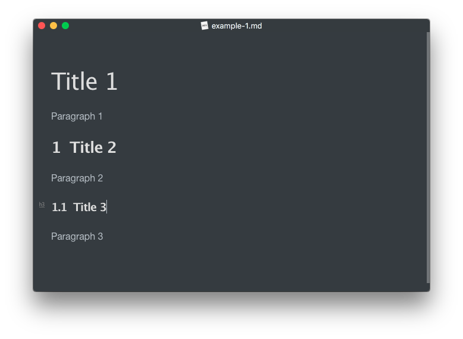

# MarkIndex

[中文版文档](README-cn.md)

A little tool to add index to your markdown titles.

## Usage

This is your markdown file:


and you run:

```bash
python markindex.py example.md
```

Then the script generate a new markdown file named `example-1.md`, it looks like this:



This script automatically add index to your markdown titles, with format like: 1.1, 1.1.2.

Note that level 1 titles are ignored, since they are overall title usually.

Checkout other options with `-h, --help` flag:

```bash
usage: markindex.py [-h] [-r] [-f] markdown [markdown ...]

Add Index to markdown titles.

positional arguments:
  markdown     markdown files to modify

optional arguments:
  -h, --help   show this help message and exit
  -r, --rm     remove index, instead of adding it.
  -f, --force  cover the original file, use with caution.
```

## Future features

1. Add more types of index
1. Customize index style
1. generate table of content. 